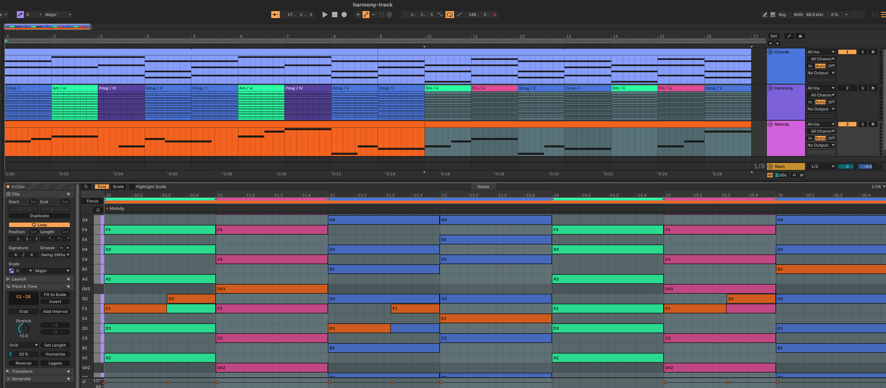

# Harmony Track

An Ableton Live extension that builds a silent harmony guide track from any MIDI clip. Like Scale mode shows you the notes in the key, the Harmony track shows you the notes in the *current chord* — layer it with your own clips in the piano roll to see which notes fit the harmony at any moment.



Select one or more MIDI clips (an arrangement selection or session clip slots), right-click → **Harmony Track: Extract**. Selected clips are analyzed *together* on the shared timeline, so chords on one track and a bassline on another combine into the true harmony (C+E+G over an A bass reads as Am7). The extension:

1. Quantizes the clip's notes to the detection grid (by default following Live's grid setting)
2. Detects the chord in each grid window and merges consecutive identical chords into regions
3. If the Set has a scale enabled, derives each chord's harmonic function in that key — including applied dominants (`A7` before `Dm` reads `V7/ii`, not `VI7`)
4. Writes one arrangement clip per chord onto a muted MIDI track named **Harmony**, created directly above the source track, time-aligned with the source clip — each named `Cmaj / I`, `Am / vi`, `G7 / V7`, … and filled with the chord tones at velocity 127 in every octave of the guide range (default C2–C5, MIDI 48–84)
5. Colors each clip by the chord root's position on the circle of fifths relative to the key (after Scriabin's circle-of-fifths color wheel, anchored key-relatively): the tonic is blue, the sharp side walks cyan → green → yellow → orange (V, ii, vi, iii, vii°), the flat side walks violet → magenta (IV, bVII, bIII, bVI, bII), and both converge on red at the chromatic tritone. Out-of-scale chord tones push a chord further toward red, so borrowed chords read warmer than diatonic ones on the same root. Settings offer a single solid color or no coloring instead; no scale set → Live's default clip color.

The Harmony track plays no sound: it stays muted and gets no instrument. Re-running the extraction replaces only the harmony clips overlapping the source clip's range, so you can extract different sections from different clips into the same track.

## Requirements

- Ableton Live 12 Suite **beta 12.4.5+** with Extensions enabled (the Extensions SDK is in public beta)
- Node.js ≥ 24.14.1 (pinned to 24.16.0 in `.nvmrc`)

## Setup

```sh
npm install
```

The SDK and CLI aren't on npm; they're vendored as tarballs in `vendor/` (`@ableton-extensions/sdk` and `@ableton-extensions/cli` 1.0.0-beta.0).

## Develop

```sh
npm test        # vitest — core analysis is pure and runs without Live
npm start       # build + run in Live via extensions-cli
npm run package # build + produce the distributable .ablx
```

Then in Live: Settings → Extensions to install/enable, and right-click any MIDI clip.

**Harmony Track: Add locators** (on an arrangement selection) runs the same analysis and writes arrangement cue points named after each chord instead of clips — useful for navigating a song's harmony from the timeline.

Multi-track selections skip tracks containing a Drum Rack, so percussion doesn't pollute chord detection.

## Settings

Access the settings by right-clicking and choosing **Harmony Track: Settings**. Settings persist across Live sessions in the extension's storage directory and apply to the next extraction — they don't retroactively change clips already on the Harmony track; re-run the extraction to apply.

| Setting | Default | What it does |
|---|---|---|
| **Detection grid** | Auto | The window size for chord detection and note quantization. *Auto* follows Live's current grid setting (snapped to the nearest of 1/16 … 1 bar); or pick an explicit size. Coarser = smoother regions that ignore passing chords; finer = catches quick changes. |
| **Secondary dominants** | On | Labels a non-diatonic dominant as `V/x` when the chord it resolves to (a fifth down) follows it inside the analyzed selection — a trailing `G` in F reads `II` because its resolution isn't in view. Off = always plain scale-degree numerals (`II`, `VI7`, …). |
| **Guide range** | 48 – 84 | MIDI pitch range the guide notes span (C2–C5 in Live's octave naming). Widen it if you write in extreme registers; narrow it to reduce clutter. |
| **Track name** | Harmony | Name of the guide track. The extension reuses any MIDI track with this name and creates one if none exists — rename here if "Harmony" collides with something in your template. |
| **Color mode** | By harmonic function | *By harmonic function* = circle-of-fifths coloring; *Single color* = every harmony clip gets the same color; *Off* = Live's default clip color. |
| **Tonic hue** | Blue (220°) | Function mode only: the anchor color for the tonic chord; the swatch previews it. All other degrees walk the color wheel relative to this anchor. |
| **Diatonic spread** | Default | Function mode only: how far apart the diatonic degrees sit on the color wheel. *Narrow* keeps the in-key family visually tight, *Wide* makes each degree more distinct. Non-diatonic chords always jump well into the warm zone regardless. |
| **Color** | Blue (220°) | Single-color mode only: the solid color applied to every harmony clip. |

Cancel (or closing the window) discards changes. Settings are validated on load, so a corrupt or out-of-date settings file falls back to defaults field by field rather than failing.

## Release

```sh
npm run release -- patch     # or minor / major / an explicit x.y.z
```

Bumps `package.json` and `manifest.json` together, runs tests and the build, commits, tags `vX.Y.Z`, and pushes. The release workflow (`.github/workflows/release.yml`) then builds the `.ablx` on CI and attaches it to a GitHub release with generated notes. Add `--dry-run` to preview the steps.

## How detection works

- **Sounding, not struck**: a pitch counts toward a beat if it *overlaps* it, so sustained pads and held notes shape the harmony of every beat they cover.
- **Carry-over**: a beat whose pitches are a subset of the previous chord's tones extends that chord — arpeggios and thinning voicings don't fragment regions.
- **Bass-aware**: detection feeds tonal's `Chord.detect` lowest-note-first, so `{A,C,E,G}` reads as Am7 over A but C6 over C. Candidates with fewer alterations win ties (first-inversion C major is `Cmaj`, not `Em#5`).
- **Numerals**: degree from the Set's root with pop-convention accidentals (`bVII`, `bII`, Lydian `#IV`), quality casing from the chord (`ii7`, `vii°`, `viiø7`, `I+`). No scale set → bare chord names.
- Rests and monophonic passages produce no chord clip — gaps are left uncovered.

## Layout

```
src/core/      pure analysis (tonal only): quantize → detect → merge regions → numerals → guide notes
src/live/      Live object helpers: clip location, Harmony track find-or-create/cleanup
src/command.ts orchestration: progress dialog, single-undo transaction, clip writing
src/extension.ts  registration (context menu + command)
test/          vitest suites for everything under src/core/
```

`docs/ableton-extensions/` holds condensed SDK reference docs and `examples/` contains cloned community extensions used as reference material; neither is part of the build.

## Limitations

- Extensions SDK 1.0.0-beta.0 is run-once with no event/observer, transport, or control-surface APIs — the track can't update live as you edit. Re-run the extraction after changing the source clip.
- Track positioning is constrained: the SDK's only placement primitive is "duplicate inserts after the original". The Harmony track lands directly above the source when the track above it is a MIDI track; if the source is the first track or sits below an audio/group track, it lands directly below instead. An existing Harmony track is reused wherever you've moved it.
- Session-view source clips anchor their harmony clips at arrangement beat 0.
- For looping clips the analysis window is `[startMarker, loopEnd)`, tiled across the clip's arrangement length.
